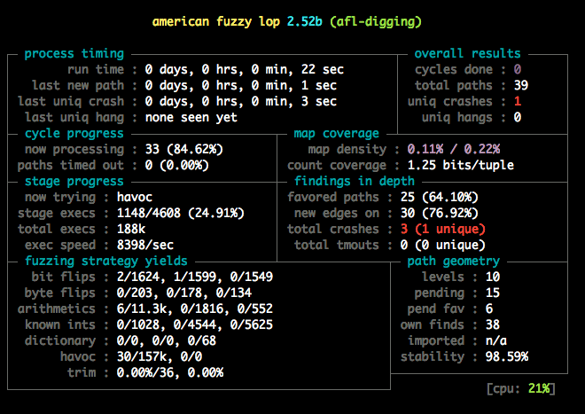

## Rust Oslo Meetup

#### Fuzzing and property-based testing

October 18th 2018 - Erik Vesteraas / evestera

(Slides: [rustoslo.github.io](https://rustoslo.github.io))

---

## Messages...

## 🍻

---

## Next meetup

Wed Nov 21st

---

## And...

Would you like to present something at a future meetup?
Is there something specific you would like to hear about?
Anything else?

Erik Vesteraas - evestera - `erik@vestera.as`

Flavio Oliveira - wisespace-io - `flavio@wisespace.io`

---

## What is fuzzing?

> Fuzzing or fuzz testing is an automated software testing technique that involves providing invalid, unexpected, or random data as inputs to a computer program.
>
> The program is then monitored for exceptions such as crashes, failing built-in code assertions, or potential memory leaks.
>
> -- *[Wikipedia on fuzzing](https://en.wikipedia.org/wiki/Fuzzing)*
---

## Finding crashes

When we say that Rust is safe, crashing is not necessarily "unsafe". There are still ways to crash even if you don't use `unsafe`.

Think `unwrap()`, `panic!()`, indexing, etc...

---

## What to fuzz

```
pub fn reverse(s: &str) -> String {
    let mut bytes: Vec<u8> = s.bytes().collect();
    bytes.reverse();
    return String::from_utf8(bytes).unwrap();
}
```

---

## Rust fuzzing

Rust Fuzzing Authority: [github.com/rust-fuzz](https://github.com/rust-fuzz)

Rust Fuzz Book: [fuzz.rs/book](https://fuzz.rs/book/)

---

## Rust fuzzing - the tools

cargo fuzz - libFuzzer

afl.rs - american fuzzy lop

honggfuzz-rs - Honggfuzz

---

### afl.rs - american fuzzy lop



---

## Byte oriented

```
fn main() {
    fuzz!(|data: &[u8]| {
        if let Ok(s) = std::str::from_utf8(data) {
            let _ = reverser::reverse(s);
        }
    });
}
```

---

## We need a nightly toolchain

`rustup override set nightly`

---

`<terminal time>`

---

```
pub fn hmm(s: &str) {
    if s.starts_with("helloworld") {
        panic!("Wat!");
    }
}
```

---

```
pub fn hmm2(s: &str) {
    let mut chars = s.chars();
    if let Some('h') = chars.next() {
        if let Some('e') = chars.next() {
            if let Some('l') = chars.next() {
                if let Some('l') = chars.next() {
                    if let Some('o') = chars.next() {
                        if let Some('w') = chars.next() {
                            if let Some('o') = chars.next() {
                                if let Some('r') = chars.next() {
                                    if let Some('l') = chars.next() {
                                        if let Some('d') = chars.next() {
                                            panic!("Wat!");
                                        }
                                    }
                                }
                            }
                        }
                    }
                }
            }
        }
    }
}
```

---

`<terminal time>`

---

## Fuzzing vs property based testing

---

## Property based testing in Rust

### quickcheck

- Based on Quickcheck for Haskell

### proptest

- Based on Hypothesis for Python

Note: Both are available on stable Rust

---

## quickcheck

```
quickcheck! {
    fn prop(xs: Vec<u32>) -> bool {
        xs == reverse(&reverse(&xs))
    }
}
```

---

## proptest

```
proptest! {
    #[test]
    fn parses_all_valid_dates(ref s in "[0-9]{4}-[0-9]{2}-[0-9]{2}") {
        parse_date(s).unwrap();
    }

    #[test]
    fn parses_date_back_to_original(y in 0u32..10000,
                                    m in 1u32..13, d in 1u32..32) {
        let (y2, m2, d2) = parse_date(
            &format!("{:04}-{:02}-{:02}", y, m, d)).unwrap();
        prop_assert_eq!((y, m, d), (y2, m2, d2));
    }
}
```

---

> QuickCheck and Proptest are similar in many ways: both generate random inputs for a function to check certain properties, and automatically shrink inputs to minimal failing cases.
>
> The one big difference is that QuickCheck generates and shrinks values based on type alone, whereas Proptest uses explicit Strategy objects.
>
> -- *[README of proptest crate](https://github.com/AltSysrq/proptest/blob/ee53956395492c8172a6d437cb0d2962f6077572/README.md#differences-between-quickcheck-and-proptest)*

---

## libdiffuzz

[Medium post - "How I’ve found vulnerability in a popular Rust crate (and you can too)"](https://medium.com/@shnatsel/how-ive-found-vulnerability-in-a-popular-rust-crate-and-you-can-too-3db081a67fb)

---

## Links and such

Rust Fuzz Book: [fuzz.rs/book](https://fuzz.rs/book/)

All the tools: [github.com/rust-fuzz](https://github.com/rust-fuzz)

Property testing crates: `quickcheck` and `proptest`

Slides etc: [rustoslo.github.io](https://rustoslo.github.io/)
