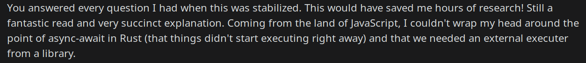
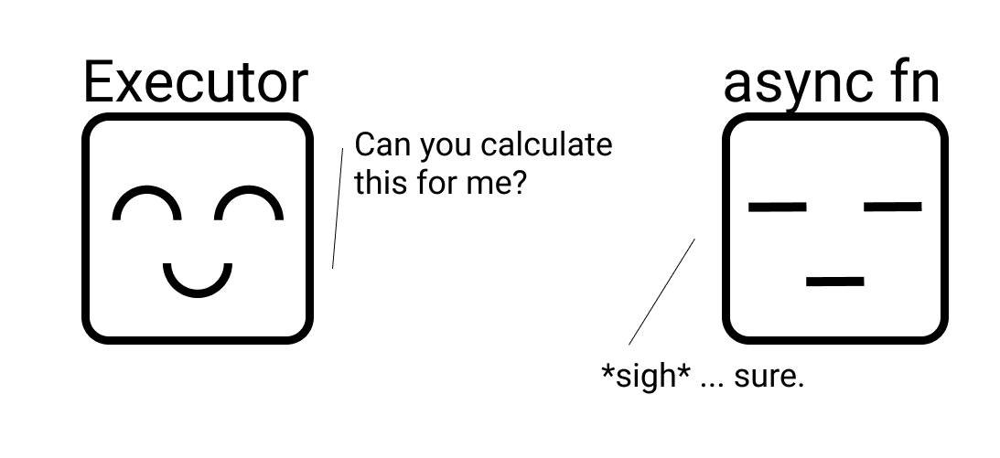
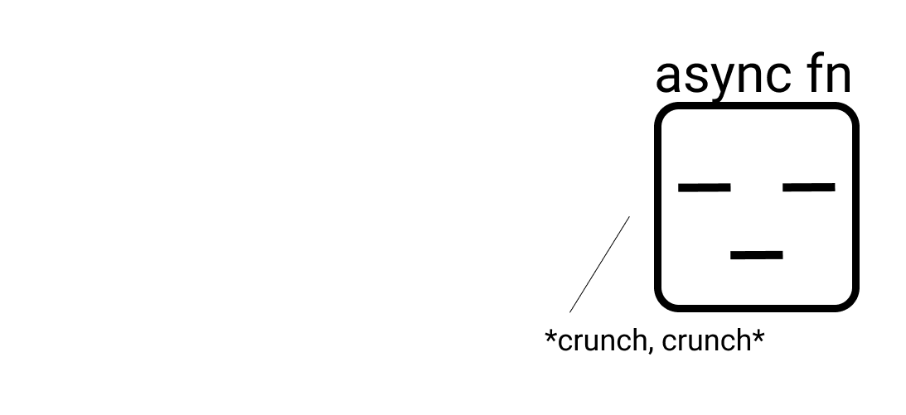
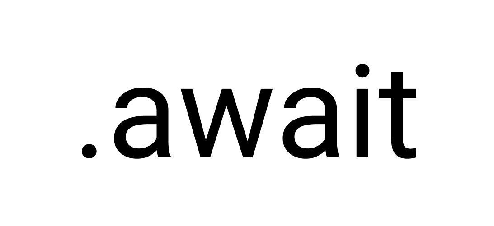
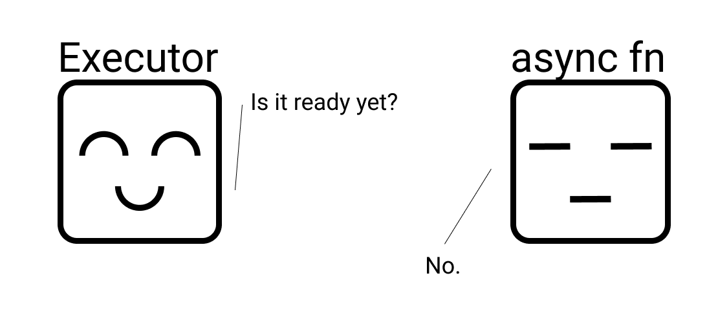
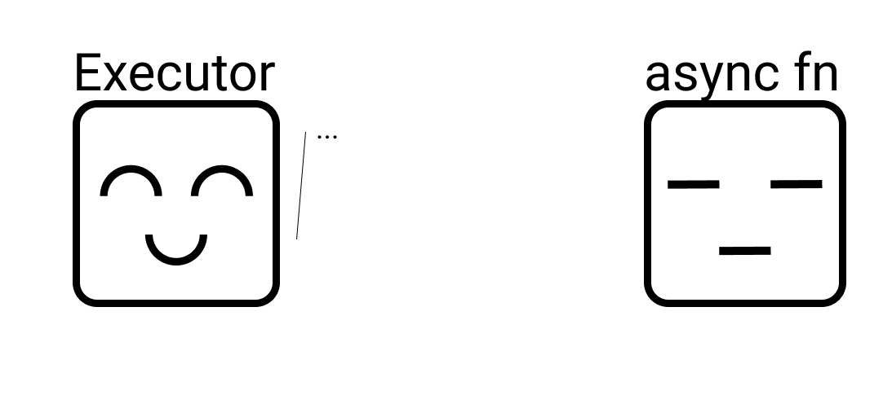
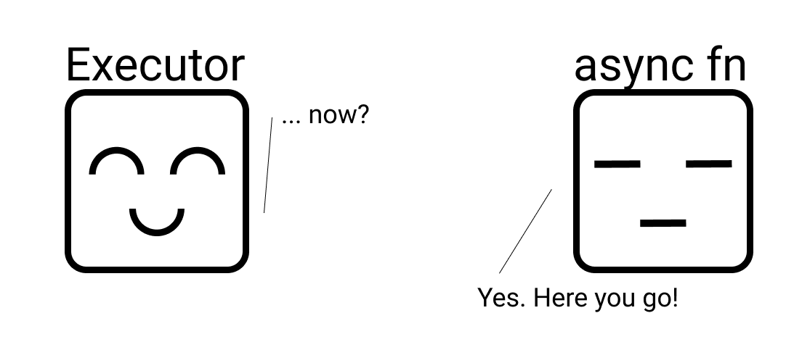
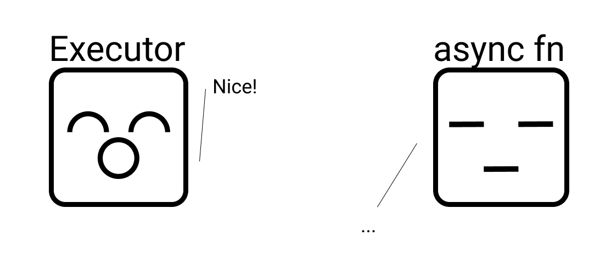

<!-- .slide: data-background="./images/thart.svg" data-background-repeat="repeat" data-background-size="100px" -->


# Async Rust
Thomas Hartmann

<!--  -->

# Background

Why is this important? Why _now_?

Notes: Rust very recently stabilized async/.await (version 1.39, November 7th 2019), and now has support for keywords `async` and `.await`. The ecosystem has been clamoring for async for a while. I have found some of the documentation on how to use async/.await unclear, so I wanted to outline how it works, how it might be different from what you're used to in other languages.

<!-- v -->



Note: based on a blog post I wrote last week, just after the stabilization. Got some good feedback on it, so thought more people might be interested in it.

<!-- v -->

It is a period of civil war ...

<!-- v -->

- async-std
- tokio
- futures.rs
- +++

Notes: there are various different options available for use with async functionality in Rust at the moment, and these are some of the most popular ones. Why are they competing? What are they competing for? Well, we'll get back to that in a bit.

<!--  -->

# What is `async`?

- A way to share a single thread
- If a function is waiting, it can yield control
- Ideal for IO tasks, such as web requests.

<!-- v -->

## But isn't that multithreading?

<!-- v -->

No.

<!--  -->

# Async in Rust

<!-- v -->

## Future values: `futures`

In Rust, an 'async value' is known as a `Future`.

Corresponds to `Task` in C#, `Promise` in JavaScript.

<!-- v -->

# Syntax

A bit different from what you might be used to

<!-- v -->

Sync:

```rust
fn f() {
  let x = g();
  println!("{}", x);
}
```

Async:

```rust
async fn f() {
  let x = g().await;
  println!("{}", x);
}
```

note: note the `.await` postscript as opposed to the more common `await` keyword

<!-- v -->

## Does not start future immediately

- A `Future` must be spawned or 'awaited'

Note:
As opposed to some other languages, just calling a function that returns a `future` does not start the future immediately.

<!-- v -->

```rust
async fn negate_async(n: i32) -> i32 {
    println!("Negating {}", n);
    task::sleep(std::time::Duration::from_secs(5)).await;
    println!("Finished sleeping for {}!", n);
    n * -1
}

async fn f() -> i32 {
    let neg = negate_async(1);
    let neg_task = task::spawn(negate_async(2));
    task::sleep(std::time::Duration::from_secs(1)).await;

    neg.await + neg_task.await
}
```

Note: we're using 'async-std' in this example. Anyone wanna guess how this executes?

<!-- v -->

```sh
Negating 2
# <- there's a 1 second pause here
Negating 1
Finished sleeping for 2!
Finished sleeping for 1!
```

<!-- v -->

```rust
async fn negate_async(n: i32) -> i32 {
    println!("Negating {}", n);
    task::sleep(std::time::Duration::from_secs(5)).await;
    println!("Finished sleeping for {}!", n);
    n * -1
}

async fn f() -> i32 {
    negate_async(1).await + negate_async(2).await
}
```

Note: what about this? From my little experimentation, this runs serially!
<!-- v -->

## You need an external library to launch tasks 😱

note: what? Yeah, I know. This was the most confusing point to me.

<!-- v -->

- Rust futures require an 'executor' to execute and watch
- Not bundled with the standard library

note: The Rust std library does not come with an executor. Design decision made because we want to see what the community comes up with before prematurely standardizing on something. 'standard library is where things go to die', etc.

<!--  -->

# Executors


<!-- v -->

## The life of an `async fn`

<!-- v -->



note: the executor asking the async fn is the task being spawned.

<!-- v -->



<!-- v -->



<!-- v -->



<!-- v -->



<!-- v -->


<!-- v -->



<!-- v -->



<!--  -->

<!-- .slide: data-background="./images/pokeball.svg" data-background-repeat="repeat" data-background-size="100px" -->

# Code examples

What does it actually look like?

<!-- v -->

<!-- .slide: data-background="./images/pokeball.svg" data-background-repeat="repeat" data-background-size="100px" -->
## Super simple application

```toml
[package]
name = "async-demo"
version = "0.1.0"
authors = ["Your Name <your.name@domain.tld>"]
edition = "2018"

[dependencies]
async-std = "1"
surf = "1"
```

```rust
use async_std::task;
use surf;
use surf::Exception;

async fn fetch(url: &str) -> Result<String, Exception> {
    surf::get(url).recv_string().await
}

fn main() {
    let url = "https://pokeapi.co/api/v2/move/surf";
    match task::block_on(fetch(url)) {
        Ok(s) => println!("Fetched results: {:#?}", s),
        Err(e) => println!("Got an error: {:?}", e),
    };
}
```

<!-- v -->

<!-- .slide: data-background="./images/pokeball.svg" data-background-repeat="repeat" data-background-size="100px" -->
## `async fn main`?

<!-- v -->

<!-- .slide: data-background="./images/pokeball.svg" data-background-repeat="repeat" data-background-size="100px" -->
use attribute `#[async_std::main]`

<!-- v -->

<!-- .slide: data-background="./images/pokeball.svg" data-background-repeat="repeat" data-background-size="100px" -->
```toml
[package]
name = "async-demo"
version = "0.1.0"
authors = ["Your Name <your.name@domain.tld>"]
edition = "2018"

[dependencies]
async-std = { version = "1", features = ["attributes"] }
surf = "1"
```

```rust
use surf;

#[async_std::main]
async fn main() {
    let url = "https://pokeapi.co/api/v2/move/surf";
    match surf::get(url).recv_string().await {
        Ok(s) => println!("Fetched results: {:#?}", s),
        Err(e) => println!("Got an error: {:?}", e),
    };
}
```

<!--  -->

# Questions?

... or find me at [thomashartmann.dev](https://thomashartmann.dev/)
